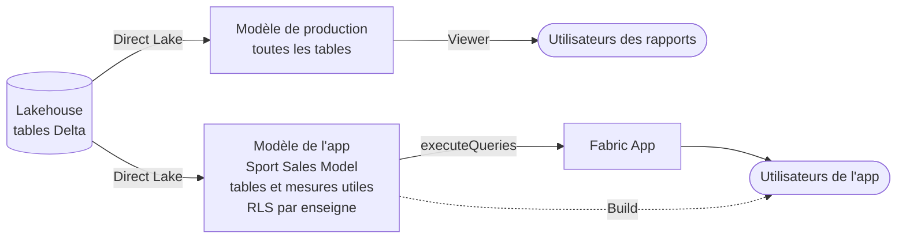
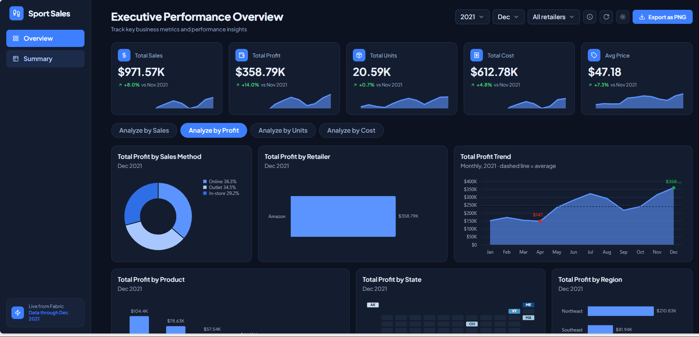

# Sport Sales — app analytique sur Microsoft Fabric

Un fichier Excel de ventes d'articles de sport devient un tableau de bord web qui interroge un modèle sémantique en direct : ingestion dans un lakehouse, modélisation en étoile, mesures DAX et application React hébergée dans Fabric.


## Architecture

```
Excel ──► Lakehouse (6 tables Delta) ──► Modèle sémantique Direct Lake ──► App React (Rayfin)
          SportSalesLH                    Sport Sales Model                  hébergée dans Fabric
```

| Étape | Ce qui se passe |
|---|---|
| **Données** | La feuille Excel (9 644 ventes, 2020–2021) est nettoyée et découpée en schéma en étoile : `fact_sales` + `dim_date`, `dim_retailer`, `dim_product`, `dim_city`, `dim_sales_method`. |
| **Modèle** | Modèle sémantique en **Direct Lake** : relations, table calendrier marquée, 23 mesures DAX (CA, profit, coût, marge, prix moyen, comparaisons mois précédent et année précédente). |
| **App** | Application React + TypeScript. Chaque filtre envoie une requête DAX au modèle : aucune donnée n'est stockée dans l'app. |
| **Hébergement** | Déployée dans Fabric avec Rayfin, authentification Microsoft : seuls les utilisateurs ayant accès au modèle voient les données. |

## Fonctionnalités

- **Overview** : filtres année / mois / enseigne, 5 cartes KPI avec écart au mois précédent et mini-courbe, onglets Sales / Profit / Units / Cost, répartitions par canal, enseigne, produit, région, carte des États en tuiles, tendance mensuelle avec min, max et moyenne.
- **Summary** : tableaux détaillés enseigne × produit et région × État, avec CA, profit, unités, marge et évolution sur un an.
- Mode clair / sombre, export PNG, états de chargement et d'erreur sur chaque visuel.


## Structure du dépôt

```
data/        CSV du schéma en étoile, générés depuis l'Excel source
model/       build_model.py : génère la définition du modèle sémantique (Direct Lake)
dashboard/   l'application React (Rayfin)
  src/queries/   une requête .dax + une spec Vega-Lite + une fonction par visuel
  src/components/ cartes KPI, graphiques, filtres
  src/pages/      pages Overview et Summary
docs/        captures d'écran
```

## Sécurité

Une data app Fabric interroge le modèle sémantique avec l'API REST **executeQueries**, au nom de l'utilisateur connecté. Cette API exige la permission **Build** sur le modèle : le rôle *Viewer* ne suffit pas.

**Le risque.** Build ne se limite pas à l'app : l'utilisateur peut aussi interroger **tout le modèle** depuis Excel (« Analyser dans Excel »), un rapport Power BI de sa création ou une requête DAX. Une table ou une colonne qu'aucun rapport n'affichait devient lisible. Le droit reste limité à ce modèle : il ne donne accès ni au lakehouse, ni aux autres modèles, ni aux autres workspaces.

**Le choix fait ici.** L'app n'est pas branchée sur un modèle de production, mais sur un **modèle dédié** :



- **Aucune copie de données** : les deux modèles lisent les mêmes tables Delta en Direct Lake (un raccourci OneLake suffit si le lakehouse est dans un autre workspace).
- **Exposition minimale** : le modèle de l'app ne contient que les tables et mesures dont l'app a besoin. Build est accordé sur lui seul ; le modèle de production reste en *Viewer*.
- **RLS dynamique par enseigne** : la table cachée `User Access` (`data/user_retailer_access.csv`) liste, pour chaque compte, les enseignes autorisées. Le rôle **Retailer Manager** filtre la table `Retailer`, et le filtre se propage aux ventes :

  ```dax
  -- Retailer
  [Retailer ID] IN CALCULATETABLE(
      VALUES('User Access'[Retailer ID]),
      'User Access'[Email] = USERPRINCIPALNAME())
  -- User Access : chacun ne voit que ses propres droits
  [Email] = USERPRINCIPALNAME()
  ```

  Ajouter un utilisateur = ajouter une ligne dans la table, sans modifier le modèle. Un compte absent de la table ne voit aucune donnée. La RLS s'applique aussi aux requêtes libres (Excel, DAX), puisque l'app interroge le modèle avec l'identité de l'utilisateur. Elle ne s'applique pas aux administrateurs, membres et contributeurs du workspace, et un service principal ne la prend pas en charge.

  | Compte de démonstration (fictif) | Enseignes visibles |
  |---|---|
  | `manager.amazon@…` | Amazon |
  | `manager.footlocker@…` | Foot Locker |
  | `manager.west@…` | West Gear, Sports Direct |
  | `direction@…` | les 6 enseignes |
  | compte absent de la table | aucune |

  Logique vérifiée en DAX pour chaque compte, puis testée avec un vrai compte membre du rôle (`manager.amazon`) : l'app n'affiche qu'Amazon, avec les mêmes montants que la vue administrateur filtrée sur Amazon.

  

  Pour l'activer : donner à l'utilisateur le rôle *Viewer* sur le workspace et *Build* sur le modèle, puis l'ajouter au rôle dans le service (modèle sémantique > *Sécurité* > *Retailer Manager*). Les membres d'un rôle ne font pas partie de la définition du modèle déployée par API, ils se gèrent dans le service. Un utilisateur non administrateur qui n'est membre d'aucun rôle n'a accès à aucune donnée.
- **Aucun secret dans le dépôt** : les identifiants de workspace et de modèle sont fournis localement (`fabric.example.yaml`, variables d'environnement), les fichiers `.env` sont exclus de Git.

## Validation

Les totaux du modèle ont été comparés à l'Excel source :

| Année | CA | Profit | Unités |
|---|---:|---:|---:|
| 2020 | 18 208 068 $ | 6 337 566 $ | 462 349 |
| 2021 | 71 782 145 $ | 26 875 910 $ | 2 016 512 |

Chaque requête de l'app a été exécutée contre le modèle avant d'être intégrée, pour utiliser les noms de colonnes exacts.

## Lancer le projet

Prérequis : Node.js LTS, Azure CLI, un workspace Fabric sur une capacité (essai possible) avec les paramètres de tenant *Fabric App Items* et *Semantic Model Execute Queries REST API* activés.

Les identifiants Fabric ne sont pas dans le dépôt : `dashboard/fabric.yaml` est créé par la commande `fabric-app-data add` ci-dessous (modèle dans `dashboard/fabric.example.yaml`), et `model/build_model.py` lit le point de terminaison SQL dans les variables `SPORT_SALES_SQL_SERVER` et `SPORT_SALES_SQL_ENDPOINT_ID`.

```bash
cd dashboard
npm install
npx rayfin login --tenant <tenant-id>
npx fabric-app-data add semanticModel sportSales -w <workspace-id> -i <semantic-model-id>
npx rayfin up --workspace-id <workspace-id>   # déploie l'app dans Fabric
npm run dev                                   # développement local
npm run test:fabric                           # ouvre l'app dans le portail Fabric (devUri)
```

## Stack

Microsoft Fabric (Lakehouse, Direct Lake, REST API) · DAX · React 19 · TypeScript · Tailwind CSS · Vega-Lite · Rayfin
